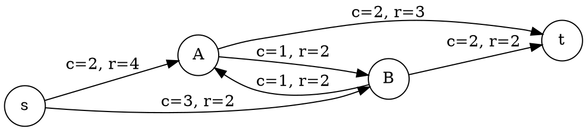

\page example_mixed_integer_rspp_bap rspp-bap
\brief Solves the resource constrained shortest path problem with idol's branch-and-price algorithm on its Dantzig-Wolfe reformulation using the Boost graph Dijkstra algorithm for the subproblem.

Resource-constrained shortest path problem (RSPP)
======================

Given a graph \\(G = (V, A)\\) where \\(V\\) is a set of nodes and \\(A\\) is a set of arcs,
the RSPP can be modeled as
\f[
\begin{align}
\min_x \quad & \sum_{(i,j)\in A} c_{ij} x_{ij} \\
\text{s.t.}\quad
& \sum_{j:(i,j)\in A} x_{ij} - \sum_{j:(j,i)\in A} x_{ji}
=
\begin{cases}
1 & i = s, \\
-1 & i = t, \\
0 & \text{otherwise},
\end{cases}
\quad \text{for all } i \in V, \\
& \sum_{(i,j)\in A} r_{ij} x_{ij} \le C, \\
& x_{ij} \in \{0,1\}, \quad \text{for all } (i,j)\in A.
\end{align}
\f]

Here, \\(c_{ij} > 0\\) denotes the travel cost of arc \\((i,j)\in A\\), \\(r_{ij} > 0\\) its
capacity consumption while \\(C\\) denotes the maximum resource consumption of a
path. The binary variable \\(x_{ij}\\) equals \\(1\\) if and only if arc \\((i,j)\in A\\) is
part of the path. The goal is to minimize the overall cost of a path.

Branch-and-Price algorithm
======================

Let \\(\Omega\\) be the set of all feasible paths connecting source \\(s\\) to sink \\(t\\) in graph \\(G\\) that satisfy the flow conservation constraints. 
For each path \\\(p \in \Omega\\), we define

* \\(c_p = \sum_{(i,j) \in p} c_{ij}\\) the total cost of path \\(p\\),
* \\(r_p = \sum_{(i,j) \in p} r_{ij}\\) the total resource consumption of path \\(p\\).

We introduce a binary decision variable \\(\lambda_p\\) for each path \\(p \in \Omega\\), where \\(\lambda_p = 1\\) if path \\(p\\) is selected, and \\(0\\) otherwise. 
The relationship with the original arc variables is given by \\(x_{ij} = \sum_{p \in \Omega} \delta_{ij}^p \lambda_p\\), where \\(\delta_{ij}^p = 1\\) if arc \\((i,j)\\) belongs to path \\(p\\), and \\(0\\) otherwise.

The Master Problem
----------------------

By replacing the original arc variables with path variables, the master problem is formulated as:

\f[
\begin{align}
\min_{\lambda} \quad & \sum_{p \in \Omega} c_p \lambda_p \\
\text{s.t.} \quad
& \sum_{p \in \Omega} r_p \lambda_p \le C, \quad && (\mu \le 0)  \\
& \sum_{p \in \Omega} \lambda_p = 1, \quad && (\pi) \\
& \lambda_p \in \{0,1\} \quad \forall p \in \Omega,
\end{align}
\f]

in which \\(\mu\\) is the dual variable associated with the resource constraint and \\(\pi\\) is the dual variable associated with the convexity constraint.

Pricing Subproblem
----------------------

Since the set \\(\Omega\\) is exponentially large, a restricted master problem (RMP) is solved over a subset of paths \\(\bar{\Omega} \subset \Omega\\). 
A path with a negative reduced cost indicates that it can improve the current solution.

The reduced cost \\(\bar{c}_p\\) of a path \\(p\\) is expressed using the optimal dual variables \\(\mu\\) and \\(\pi\\) from the RMP as
\f[
\bar{c}_p = c_p - \mu r_p - \pi.
\f]

Expressing \\(c_p\\) and \\(r_p\\) back in terms of the original arcs, we obtain
\f[
\bar{c}_p = \sum_{(i,j) \in p} (c_{ij} - \mu r_{ij}) - \pi.
\f]

The pricing subproblem aims to find a path \\(p \in \Omega\\) that minimizes this reduced cost. Dropping the constant \\(\pi\\), the optimization subproblem becomes
\f[
\min_{p \in \Omega} \sum_{(i,j) \in p} (c_{ij} - \mu r_{ij}).
\f]

Therefore, the pricing subproblem reduces to a standard shortest path problem on graph \\(G\\) from \\(s\\) to \\(t\\) with modified arc weights.
In this example, the subproblem will be solved using the Dijkstra's algorithm from Boost Graph library.

Graph definition
======================

We consider a simple instance defined on a directed graph \\(G = (V, A)\\).

The node set is given by
\f[
V = \{s, A, B, t\}
\f]

and the arc set is
\f[
A = \{(s,A), (s,B), (A,t), (B,t), (A,B), (B,A)\}.
\f]

Each arc \\((i,j) \in A\\) is associated with a cost \\(c_{ij}\\) and a resource consumption \\(r_{ij}\\):

| Arc \\((i,j)\\) | Cost \\(c_{ij}\\) | Resource \\(r_{ij}\\) |
|:---------------:|:-----------------:|:---------------------:|
|   \\((s,A)\\)   |         2         |           4           |
|   \\((s,B)\\)   |         3         |           2           |
|   \\((A,t)\\)   |         2         |           3           |
|   \\((B,t)\\)   |         2         |           2           |
|   \\((A,B)\\)   |         1         |           2           |
|   \\((B,A)\\)   |         1         |           2           |

The resource capacity is \\(C = 6\\).

Implementation in idol
======================

\include ../examples/mixed-integer/rspp-bap.example.cpp
